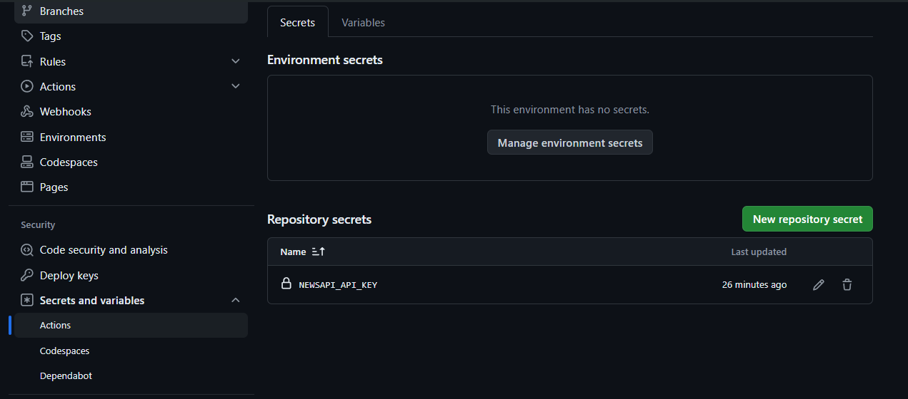

# API Integration with GitHub Actions

This repository contains a Python script that makes requests to NewsAPI using an API key stored securely.

## Importance of API Key Security

API keys are credentials that allow access to external services and must be kept confidential to prevent unauthorized use.

## Project Configuration

### Project Structure

- `test_api_key.py`: Python script that makes requests to NewsAPI using an API key loaded from a `.env` file.
- `.github/workflows/test_api_key.yml`: GitHub Actions workflow that sets up and runs the script securely with an API key configured as a secret in GitHub.
- `env-example`: An example environment file that shows the necessary environment variables with placeholder values. You should duplicate this file, rename it to `.env`, and replace the placeholders with actual values to configure the project securely.

### Configuration of Secrets in GitHub

To protect your API keys, you should configure them as secrets in GitHub:

1. Navigate to "Settings" > "Secrets and variable" > "Actions" in your GitHub repository.
2. Click on "New repository secret".
3. Add the name `NEWSAPI_API_KEY` and the value of your API key.

## Local Execution

To run the script locally:

1. Ensure you have a `.env` file with the correct key in your local directory.
2. Run the script with Python, making sure all dependencies are installed.

This ensures that your API key is handled securely and is not exposed in the repository, protecting your access and the integrity of your data.
